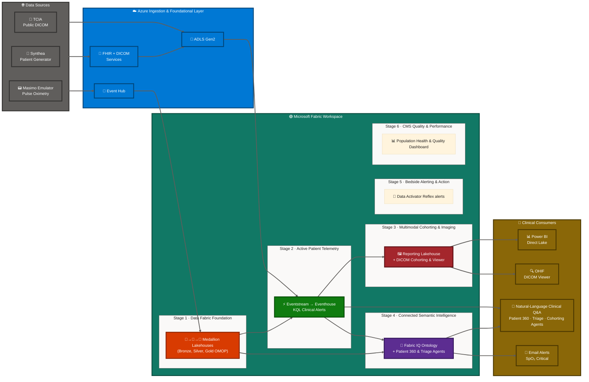
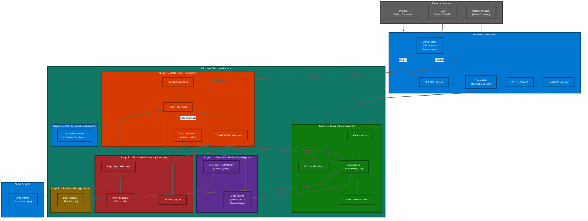
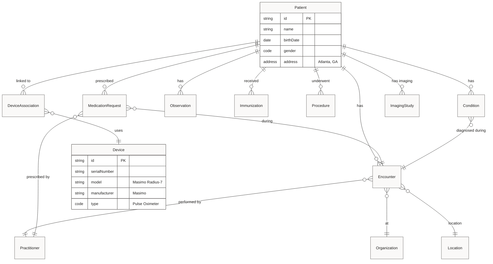
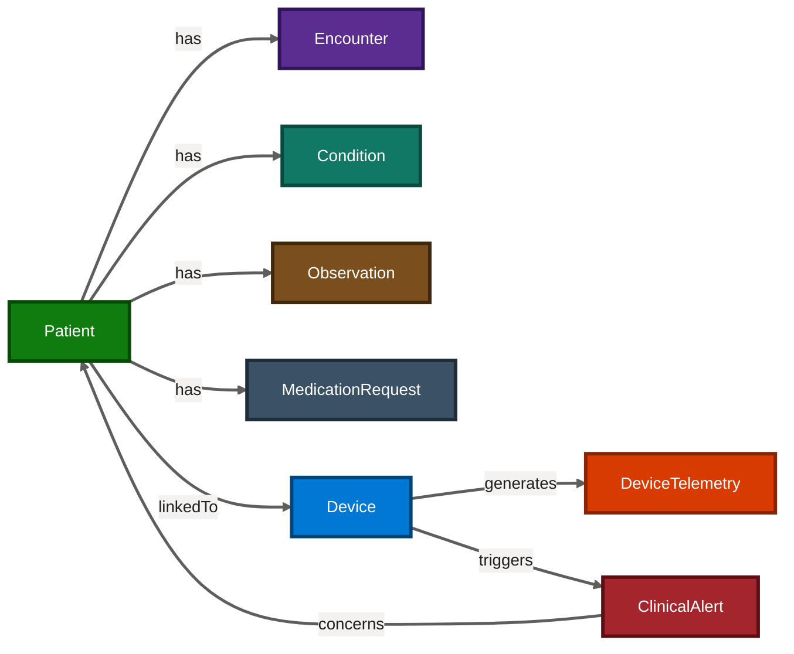

# Medical Device FHIR Integration Platform

A complete, deployable reference architecture that unifies healthcare EHR data and real-time medical device telemetry on Microsoft Fabric — from ingestion to AI-powered clinical queries in a single workspace.


> [!TIP]
> 🚀 **Ready to deploy?** [**Skip to Quick Start ⬇**](#quick-start) to set up the platform on your machine in minutes.


#### Video Explainer
**▶ [Watch the video explainer](https://aka.ms/fabrichlsrti)**

**What this solution demonstrates:**
- **Real-Time Intelligence** — Masimo pulse oximeter telemetry streams through Eventstream into Eventhouse with KQL-based clinical alert detection (SpO2 drops, abnormal pulse rates) in seconds
- **Healthcare Data Solutions** — 10K synthetic FHIR R4 patients (5M+ clinical resources) flow into a Silver Lakehouse via Fabric's native HDS connector with zero custom ETL
- **DICOM Medical Imaging** — Real TCIA chest CT studies are downloaded, re-tagged with Synthea patient identifiers, stored in ADLS Gen2, and ingested into Fabric HDS via a OneLake shortcut and the imaging pipeline
- **Data Agents** — Two natural-language AI agents (Patient 360 + Clinical Triage) let users ask questions like *"Show me all patients with SpO2 below 90 and their active conditions"* — federating across KQL telemetry and Lakehouse clinical data in one response
- **Cohorting Toolkit** — Power BI imaging report (Direct Lake) + OHIF DICOM Viewer + Cohorting Data Agent deployed via the companion [FabricDicomCohortingToolkit](../FabricDicomCohortingToolkit/) repo
- **Fabric IQ Ontology** — A 9-entity semantic layer (Patient, Device, Encounter, Condition, MedicationRequest, Observation, DeviceAssociation, ClinicalAlert, DeviceTelemetry) with relationships across Lakehouse and Eventhouse, bound to all Data Agents
- **Data Activator** — A Reflex item with KQL source (`fn_ClinicalAlerts`), Device object, 6 attributes, and an email rule that alerts on CRITICAL/URGENT SpO2 events — deployed fully programmatically via the Fabric REST API
- **Population Health & Quality** — 7 CMS eCQM quality measures, 3 HEDIS PDC classes, Star Rating simulator, HCC risk adjustment (CMS-HCC V28), 30-day readmission risk ML model, cost & utilization analytics (PMPM, IP/1K, ED/1K), and a 10-page Population Health & Quality Dashboard Power BI report with Data Activator alerting
- **OneLake** — One copy of the data, queryable from KQL, Spark, SQL, and Power BI without duplication

The entire solution deploys in under 2 hours via the **Orchestrator UI** (browser-based deployment wizard) or a single command (`Deploy-All.ps1`) and touches eight Fabric workloads: Real-Time Intelligence, Data Engineering, Data Warehouse, Data Science, Data Agents, Data Activator, Power BI, and Healthcare Data Solutions.

---

## 📑 Table of Contents

| Stage | Description | Guide |
|-------|-------------|-------|
| **Stage 1: Data Fabric Foundation** | Azure base infra, FHIR + DICOM data generation, HDS workspace managed identity | [Stage 1 — Data Fabric Foundation](docs/phase-1-infrastructure-and-ingestion.md) |
| **Stage 2: Active Patient Telemetry** | Masimo real-time pulse oximetry streaming, Eventstream, Eventhouse KQL alert policies | [Stage 2 — Active Patient Telemetry](docs/phase-2-hds-enrichment-and-agents.md) |
| **Stage 3: Multimodal Cohorting & Imaging** | Healthcare Data Solutions (HDS) pipelines, DICOM shortcuts, OHIF Viewer, cohorting agent | [Stage 3 — Multimodal Cohorting & Imaging](docs/phase-3-imaging-and-cohorting.md) |
| **Stage 4: Connected Semantic Intelligence** | ClinicalDeviceOntology semantic layer, conversational data agents (Patient 360, Triage) | [Stage 4 — Connected Semantic Intelligence](docs/phase-4-ontology-and-activator.md) |
| **Stage 5: Bedside Alerting & Action** | Data Activator Reflex engine, real-time alert attribute routing, email rules and cooldowns | [Stage 5 — Bedside Alerting & Action](docs/phase-4-ontology-and-activator.md) |
| **Stage 6: CMS Quality & Performance** | Claims star schema tables, eCQM clinical quality measures, Power BI Quality Scorecard | [Stage 6 — CMS Quality & Performance](docs/phase-5-cms-quality-and-claims.md) |

**Additional guides:**
- [Orchestrator UI](orchestrator/README.md) — Setup and usage for the browser-based deployment dashboard
- [HDS Setup Guide](fabric-rti/HDS-SETUP-GUIDE.md) — Manual HDS deployment walkthrough
- [Dashboard Guide](fabric-rti/dashboard/DASHBOARD-GUIDE.md) — Real-time dashboard details
- [Ontology Setup Guide](docs/ONTOLOGY-SETUP-GUIDE.md) — Fabric IQ Ontology configuration
- [Ontology Design Plan](.ai/FABRIC-IQ-ONTOLOGY-PLAN.md) — Data model and entity relationships

**AI/planning artifacts** (in [`.ai/`](.ai/)):
- [OpenSpec](.ai/OPENSPEC.md) — Full project specification
- [PRD](.ai/PRD.md) — Product Requirements Document
- [TODO Items](.ai/TODO-ITEMS.MD) — Prioritized backlog
- [Ontology Design Plan](.ai/FABRIC-IQ-ONTOLOGY-PLAN.md) — Entity model design
- [Theming](.ai/themeing.md) — Fabric UI color/theme reference

---

## 🏗️ Architecture

### Platform Architecture Overview

A high-altitude view of the platform — data sources flow through Azure's ingestion layer into Fabric's four phased workloads, and out to the clinical consumers who actually use it.



<details>
<summary><strong>🔍 View the detailed draw.io architecture diagram</strong></summary>

Open [`docs/images/architecture-diagram.drawio`](docs/images/architecture-diagram.drawio) in [draw.io](https://app.diagrams.net/) or the VS Code Draw.io Integration extension for the full component-level view.

</details>

### End-to-End Data Flow



### Deployment Sequence

| Step | Script | Phase | What It Does |
|------|--------|-------|--------------|
| 1 | `phase-1/deploy.ps1` | 1 | Event Hub, ACR, Key Vault, emulator ACI |
| 1b | Fabric API (inline) | 1 | Fabric workspace, capacity, managed identity |
| 2 | `phase-1/deploy-fhir.ps1 -SkipDicom` | 1 | FHIR Service, Synthea, FHIR Loader, Device Associations |
| 2b | `phase-1/deploy-fhir.ps1 -RunDicom` | 1 | DICOM loader, TCIA download, re-tag, ADLS upload |
| 3 | `deploy-fabric-rti.ps1` | 1 | Eventhouse, Eventstream, KQL, dashboard, FHIR $export |
| 4 | **Manual** (Fabric portal) | — | Deploy HDS + add scipy + run pipelines |
| 5 | `deploy-fabric-rti.ps1 -Phase2` | 2 | Silver shortcuts, enriched alerts, alerts map |
| 5b | `phase-2/storage-access-trusted-workspace.ps1` | 2 | DICOM shortcut + HDS clinical/imaging/OMOP pipelines |
| 6 | `phase-2/deploy-data-agents.ps1` | 2 | Patient 360 + Clinical Triage agents |
| 7 | FabricDicomCohortingToolkit | 3 | Cohorting Agent, DICOM Viewer, reporting notebook, PBI report |
| 8 | `phase-4/deploy-ontology.ps1` | 4 | ClinicalDeviceOntology (9 entity types, 5 relationships) |
| 9 | `Deploy-All.ps1 -Phase4` | 4 | Ontology binding to agents, Data Activator (Reflex) with email rule |

### FHIR Resource Relationships



### Fabric IQ Ontology (Semantic Layer)



---

<a name="quick-start"></a>
## 🚀 Quick Start


> **The Orchestrator UI is the supported, recommended path for every deployment.** The CLI scripts exist for automation, CI/CD, and advanced scenarios — but interactive deployments, monitoring, and teardown should all go through the browser-based wizard.

### 📋 Prerequisites & Requirements

Before deploying the platform, ensure you meet the requirements below. For a seamless setup, the local requirements are automatically checked and installed by our preflight script.

> [!IMPORTANT]
> **Local Requirements Auto-Installation:**
> Any missing local dependencies (PowerShell, Azure CLI, Python, Node.js, etc.) will be **automatically installed and configured** by the preflight script (`setup-prereqs.ps1` or `setup-prereqs.sh`) if they are not detected on your machine. You do not need to install them manually.

---

#### 💻 1. Local Machine Requirements

These tools are needed to run the deployment scripts and host the Orchestrator UI:

*   **PowerShell 7+** (Core) — Used to run the cross-platform deployment orchestration scripts.
*   **Azure CLI (with Bicep)** — Handles resource deployment in Azure.
*   **Azure PowerShell module (`Az`)** — Automates Azure Health Data Services and resource group operations.
*   **Python 3.10+** — Powers the FastAPI backend for the Orchestrator UI.
*   **Node.js 18+** — Builds and serves the React-based Vite frontend.
*   **Git** — Clones and pulls solution updates.

> [!TIP]
> **How to run the preflight setup script:**
> ```powershell
> # Windows (Run as Administrator in PowerShell)
> .\setup-prereqs.ps1
> 
> # macOS / Linux (Terminal)
> chmod +x setup-prereqs.sh
> ./setup-prereqs.sh
> ```
> *To only check status without installing missing tools, run: `.\setup-prereqs.ps1 -CheckOnly`*

---

#### ☁️ 2. Azure & Microsoft Fabric Requirements

These cloud permissions and settings must be configured prior to running the deployment:

*   **Azure Subscription Context:**
    *   An active Azure subscription with owner or contributor permissions to create: Resource Groups, Health Data Services (FHIR/DICOM), Azure Container Registry (ACR), Azure Container Instances (ACI), Storage Accounts (ADLS Gen2), and User-Assigned Managed Identities.
*   **Active Cloud Session Authentication (Mandatory):**
    *   You must be signed into the same tenant and subscription context on both command-line tools:
        *   `az login`
        *   `Connect-AzAccount`
    *   Verify both contexts match: `az account show` and `Get-AzContext`.
*   **Microsoft Fabric Capacity:**
    *   A **Paid Fabric Capacity (F-SKU, e.g., F2 or F64)**.
    *   > [!WARNING]
        > **Fabric Trial Capacities are not supported:** Microsoft Fabric trial environments cannot deploy or host Healthcare Data Solutions (HDS) workspaces and pipelines, which are core to this solution.
*   **Fabric Tenant Settings:**
    *   The following tenant settings must be enabled by your Fabric administrator:
        *   **Data Activator** (for real-time oximeter alerting)
        *   **Copilot and Azure OpenAI Service** (for the AI Patient 360 & Triage Data Agents)

### Deploy with the Orchestrator UI

The Orchestrator UI is a browser-based deployment dashboard that handles the entire lifecycle — wizard-driven deploys, real-time phase monitoring, parallel teardowns, resource scanning, lock protection, and deployment history. A background resource scan fires the moment the UI loads, so every tab has its data ready before you click.

**1. Start everything with one command:**

```powershell
.\Start-WebUI.ps1
```

That's it. `Start-WebUI.ps1` will:
- Run `setup-prereqs.ps1 -CheckOnly` to verify PowerShell, Azure CLI, Python, Node.js, venv, and npm dependencies are all in place (use `-InstallPrereqs` to auto-install anything missing).
- Start the FastAPI backend on port **7071** (activating the venv for you).
- Start the Vite frontend on port **5173**.
- Detect and offer to reclaim ports already in use.

To stop everything later:

```powershell
.\Stop-WebUI.ps1 -Force
```

**2. Open the UI:** Navigate to [http://localhost:5173](http://localhost:5173).

**3. Deploy:**
- Click the **Deploy** tab.
- The Azure subscription and Fabric capacity pickers are preloaded by the background scan.
- Enter a deployment name (e.g., `med-rojo-0408`), patient count, and alert email.
- Click **Start Deployment** — the UI orchestrates all four phases automatically and streams progress.

**4. Monitor:** The deployment monitor shows real-time milestone tracking, phased log streaming, elapsed time, and a resource panel populated as each component comes up. You can safely close and re-open the browser tab; progress resumes from the backend.

**5. Teardown:**
- Click the **Teardown** tab — resource candidates (Fabric workspaces, Azure RGs, orphaned Entra SPNs) are already listed from the background scan.
- Check the items you want to remove. Paired workspace + RG deployments are highlighted together automatically.
- Click **Delete Selected** — each selected workspace and each selected Azure RG fires as its own independent parallel teardown job. The UI navigates to history so you can watch them all progress side-by-side.
- Fabric workspace deletion cascades to every item inside (no item-by-item loop); only the workspace managed identity is cleaned up separately as its own phase.


<details>
<summary><strong>Manually starting the servers (if you don't want to use Start-WebUI.ps1)</strong></summary>

```powershell
# Terminal 1 — backend
cd orchestrator
.\.venv\Scripts\Activate.ps1   # Windows
# source .venv/bin/activate     # macOS/Linux
python local_server.py

# Terminal 2 — frontend
cd orchestrator-ui
npm run dev
```

</details>

---

### CLI & Automation (Advanced)

For DevOps, automation, and advanced CI/CD scripting pipelines, the entire platform lifecycle can be managed via command-line PowerShell scripts.

#### 🛠️ Command-Line Interface (CLI) Cheatsheet

| Operational Objective | Command Syntax | Key Flags & Use Cases |
| :--- | :--- | :--- |
| **Check & Install Prerequisites** | `.\setup-prereqs.ps1` | Detects and automatically installs all missing local toolchains |
| **Prerequisites Dry-Run (Check-Only)** | `.\setup-prereqs.ps1 -CheckOnly` | Runs diagnostic validation without installing any software |
| **Deploy Complete Platform** | `.\Deploy-All.ps1 -ResourceGroupName "rg-med" -Location "eastus" -FabricWorkspaceName "ws-med" -AdminSecurityGroup "admins" -PatientCount 100 -AlertEmail "nurse@hospital.com"` | Automates the deployment of all four platform phases in sequence |
| **Bypass Base Azure Infra** | `.\Deploy-All.ps1 -SkipBaseInfra [other params]` | Reuses existing base Azure container registries and oximeter resources |
| **Rebuild Container Images** | `.\Deploy-All.ps1 -RebuildContainers [other params]` | Rebuilds and pushes fresh Docker images to Azure Container Registry |
| **Run Specific Stage / Phase** | `.\Deploy-All.ps1 -Phase2 [other params]` or `-Phase3`, `-Phase4` | Executes targeted deployment steps (e.g., agents, ontology, or cohorting) |
| **Quick Start Orchestrator Web UI** | `.\Start-WebUI.ps1` | Launches both backend API (7071) and React dashboard (5173) |
| **Teardown Platform Infrastructure** | `.\Teardown-All.ps1 -FabricWorkspaceName "ws-med" -ResourceGroupName "rg-med" -Force` | Performs teardown of workspace managed identities, cloud resources, and RG |

<details>
<summary><strong>Click to expand — PowerShell-only deployment details and examples</strong></summary>

The UI calls the same underlying scripts shown below. Use these directly only if you are scripting deployments, embedding in a pipeline, or debugging a specific phase.

```powershell
# Full deploy (all phases, ~90 min):
.\Deploy-All.ps1 `
    -ResourceGroupName "rg-medtech-rti-fhir" `
    -Location "eastus" `
    -FabricWorkspaceName "med-device-rti-hds" `
    -AdminSecurityGroup "sg-azure-admins" `
    -PatientCount 100 `
    -AlertEmail "nurse@hospital.com" `
    -Tags @{SecurityControl='Ignore'}

# ── Or run individual phases: ──

# Phase 1: Azure infra + FHIR data + Fabric RTI (~25 min)
.\Deploy-All.ps1 `
    -ResourceGroupName "rg-medtech-rti-fhir" `
    -Location "eastus" `
    -FabricWorkspaceName "med-device-rti-hds" `
    -AdminSecurityGroup "sg-azure-admins" `
    -PatientCount 100 `
    -Tags @{SecurityControl='Ignore'}

# ── Manual: Deploy HDS in Fabric portal (see Phase 1 guide) ──

# Phase 2: HDS enrichment + Data Agents (~35 min)
.\Deploy-All.ps1 -Phase2 `
    -ResourceGroupName "rg-medtech-rti-fhir" `
    -Location "eastus" `
    -FabricWorkspaceName "med-device-rti-hds" `
    -Tags @{SecurityControl='Ignore'}

# Phase 3: Imaging toolkit (~10 min)
.\Deploy-All.ps1 -Phase3 `
    -FabricWorkspaceName "med-device-rti-hds" `
    -Location "eastus" `
    -ResourceGroupName "rg-medtech-rti-fhir" `
    -DicomToolkitPath "C:\git\FabricDicomCohortingToolkit"

# Phase 4: Ontology + Data Activator (~5 min)
.\Deploy-All.ps1 -Phase4 `
    -FabricWorkspaceName "med-device-rti-hds" `
    -Location "eastus" `
    -AlertEmail "nurse@hospital.com" `
    -AlertTierThreshold "URGENT" `
    -AlertCooldownMinutes 15
```

**CLI Teardown:**

```powershell
# Full teardown: Azure RGs + Fabric workspace + DICOM viewer
.\Teardown-All.ps1 -FabricWorkspaceName "med-device-rti-hds" `
    -ResourceGroupName "rg-med-device-rti" -Force -Wait
```

> For interactive teardown, prefer the UI — it scans all resources, highlights paired workspace + RG pairs, fires each deletion in its own parallel job, and uses the fast Fabric workspace-cascade path instead of iterating items.

</details>

---

## 📁 Project Structure

```
med-device-fabric-emulator/
├── setup-prereqs.ps1           # Cross-platform prerequisite installer
├── Deploy-All.ps1              # Full orchestrator (all phases)
├── deploy-fabric-rti.ps1       # Phase 1 + 2: Fabric RTI
├── Teardown-All.ps1            # Cleanup orchestrator
├── phase-1/
│   ├── deploy.ps1              # Azure infra (Event Hub, ACR, emulator ACI)
│   └── deploy-fhir.ps1         # FHIR + DICOM pipeline
├── phase-2/
│   ├── deploy-data-agents.ps1  # Data Agents (Patient 360 + Clinical Triage)
│   └── storage-access-trusted-workspace.ps1  # HDS pipeline triggers
├── phase-4/
│   └── deploy-ontology.ps1     # Fabric IQ Ontology
├── utilities/
│   ├── update-agents-inline.ps1  # Quick-update agent definitions
│   └── run-kql-scripts.ps1     # Manual KQL script runner
├── create-device-associations.py  # Link devices to patients
├── emulator.py                 # Masimo device emulator
├── Dockerfile                  # Emulator container
├── orchestrator/               # Deployment backend (FastAPI + Python)
│   ├── local_server.py         # Backend API server (port 7071)
│   ├── requirements.txt        # Python dependencies
│   ├── activities/             # Deployment activities (PowerShell invocation)
│   └── shared/                 # Fabric client, Kusto client, database
├── orchestrator-ui/            # Deployment frontend (React + Fluent UI)
│   ├── package.json            # Node.js dependencies
│   └── src/
│       ├── pages/              # Deploy wizard, History, Teardown, Monitor
│       └── components/         # PhaseCard, AllLogsStream, ResourcesPanel
├── bicep/                      # ARM/Bicep templates
├── cleanup/                    # Teardown scripts
├── dicom-loader/               # TCIA download + DICOM re-tagging
├── .ai/                        # AI/planning artifacts (specs, PRD, TODOs)
├── docs/
│   ├── phase-1-infrastructure-and-ingestion.md
│   ├── phase-2-hds-enrichment-and-agents.md
│   ├── phase-3-imaging-and-cohorting.md
│   ├── phase-4-ontology-and-activator.md
│   ├── ONTOLOGY-SETUP-GUIDE.md
│   └── images/
├── fabric-rti/                 # KQL scripts, dashboards, HDS guide
├── fhir-loader/                # FHIR bundle loader
└── synthea/                    # Patient generator config
```

---

## 🔐 Authentication & Security

The solution uses **User-Assigned Managed Identities** for all service-to-service communication:
- `FHIR Data Contributor` — read/write FHIR Service
- `Storage Blob Data Contributor` — access Synthea output + $export blobs
- `Azure Event Hubs Data Sender` — emulator → Event Hub
- `AcrPull` — pull container images from ACR

No connection strings or secrets are stored in code. The Fabric workspace uses a provisioned managed identity for trusted workspace access to ADLS Gen2.

---

## 🤝 Contributing

1. Fork the repository
2. Create a feature branch
3. Make your changes
4. Submit a pull request

## 📄 License

This project is licensed under the MIT License - see the [LICENSE](LICENSE) file for details.

## 🙏 Acknowledgments

- [Synthea](https://synthetichealth.github.io/synthea/) - Synthetic patient generator
- [Azure Health Data Services](https://azure.microsoft.com/en-us/products/health-data-services/) - FHIR platform emulating an EHR integration
- [Masimo](https://www.masimo.com/) - Medical device specifications reference
- [Microsoft Fabric](https://www.microsoft.com/en-us/microsoft-fabric) - Real-Time Intelligence, Analytics and Full Data Estate Managmement platform
- [Healthcare Data Solutions](https://learn.microsoft.com/en-us/industry/healthcare/healthcare-data-solutions/overview) - FHIR data foundations on Fabric
- [Fabric IQ](https://learn.microsoft.com/fabric/iq/overview) - Unified semantic layer and ontology workload
- [Ontology (preview)](https://learn.microsoft.com/fabric/iq/ontology/overview) - Enterprise vocabulary and data binding
- [OHIF Viewer](https://ohif.org) - Open-source DICOM viewer (MIT)
- [TCIA](https://www.cancerimagingarchive.net/) - The Cancer Imaging Archive (public DICOM studies)