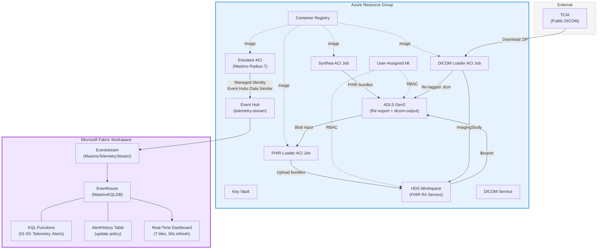
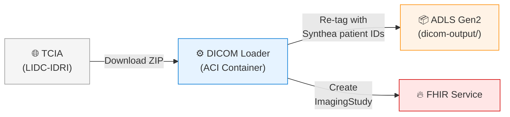

# Phase 1 — Azure Infrastructure & Data Ingestion

Phase 1 deploys all Azure infrastructure, generates synthetic clinical data, loads it into FHIR & DICOM services, and stands up the Fabric Real-Time Intelligence pipeline. This is the foundational phase — everything else builds on it.

**Typical duration:** ~25 minutes (50 patients) · **Steps:** 1 → 1b → 2 → 2b → 3 → 4

---

## Prerequisites

> **These prerequisites are required for both the Orchestrator UI and command-line (`Deploy-All.ps1`) deployments.** The setup script detects your OS and provides platform-specific install commands for anything that's missing.

```powershell
# Windows (PowerShell)
.\setup-prereqs.ps1

# macOS / Linux (bash — installs PowerShell Core if missing)
chmod +x setup-prereqs.sh
./setup-prereqs.sh
```

**Local tools:** PowerShell 7+, Azure CLI + Bicep, Az PowerShell module, Python 3.10+, Node.js 18+, Git

**Azure/Fabric:**
- Azure subscription with permissions to create resource groups, Health Data Services, ACR, ACI, Storage, and Managed Identities
- Logged in to Azure CLI (`az login`)
- Logged in to Azure PowerShell (`Connect-AzAccount`)
- Azure CLI and Az PowerShell contexts aligned to the same subscription/tenant
- Microsoft Fabric capacity (**paid F-SKU** such as F2 or F64 — trial capacities cannot deploy Healthcare Data Solutions)

To check without installing anything: `.\setup-prereqs.ps1 -CheckOnly`

---

## Architecture



---

## Step 1 — Base Azure Infrastructure

**Script:** `phase-1/deploy.ps1`

Deploys the foundational Azure resources into a single resource group:

| Resource | Purpose |
|----------|---------|
| **Event Hub Namespace** + `telemetry-stream` hub | Receives real-time telemetry from the Masimo emulator |
| **Azure Container Registry (ACR)** | Stores container images for emulator, Synthea, FHIR loader, DICOM loader |
| **Key Vault** | Stores Event Hub connection strings |
| **Emulator ACI** | Runs `emulator.py` — simulates Masimo Radius-7 pulse oximeters streaming SpO2, pulse rate, and perfusion index |

The emulator uses a **managed identity** with `Azure Event Hubs Data Sender` RBAC to authenticate to Event Hub (no connection strings in code).

```powershell
# Standalone
.\phase-1\deploy.ps1 -ResourceGroupName "rg-medtech-rti-fhir" -Location "eastus" `
    -AdminSecurityGroup "sg-azure-admins" -Tags @{SecurityControl='Ignore'}
```

### Idempotency

Deploy-All.ps1 checks for existing infrastructure before re-deploying:
- Queries the `infra` deployment in the resource group
- Validates ACR health via `az acr show`
- If the emulator ACI is missing, re-runs `phase-1/deploy.ps1`
- Verifies emulator managed identity has `Event Hubs Data Sender` RBAC; assigns + restarts if missing

---

## Step 1b — Fabric Workspace

**Script:** Inline in `Deploy-All.ps1`

Creates the Fabric workspace early so Healthcare Data Solutions can be deployed in the portal while the Azure steps continue.

| Action | Detail |
|--------|--------|
| Create workspace | via `POST /v1/workspaces` |
| Assign capacity | Auto-discovers an active paid Fabric capacity (F-SKU) |
| Provision identity | `POST /v1/workspaces/{id}/provisionIdentity` — needed for trusted workspace access |

The workspace is reused if it already exists.

---

## Step 2 — FHIR Service + Synthea + Loader

**Script:** `phase-1/deploy-fhir.ps1 -SkipDicom`

### Infrastructure

| Resource | Purpose |
|----------|---------|
| **HDS Workspace** | Azure Health Data Services workspace |
| **FHIR R4 Service** | Stores clinical resources (Patient, Condition, Encounter, etc.) |
| **Storage Account** | Blob storage for Synthea output + FHIR `$export` destination |
| **User-Assigned MI** | `FHIR Data Contributor` + `Storage Blob Data Contributor` + `AcrPull` |

### Synthea Generation

Generates synthetic patients for the **Atlanta, Georgia** metropolitan area:
- Configurable count via `-PatientCount` (default: 500)
- Complete medical histories: conditions, medications, encounters, observations, immunizations
- Demographics matching real Atlanta population distributions
- Outputs FHIR R4 transaction bundles to blob storage

### FHIR Loading

The FHIR loader (`fhir-loader/load_fhir.py`) handles:

1. **Stub resource injection** — Creates Organization, Practitioner, and Location stubs for Synthea's external conditional references
2. **Reference transformation** — Converts `urn:uuid:` references to server-assigned IDs
3. **Bundle splitting** — Splits bundles with >400 entries to avoid FHIR server limits
4. **Retry logic** — Handles transient failures and RBAC propagation delays

### Device Associations

After loading patient data, `create-device-associations.py` runs:
- Creates **100 Masimo Radius-7** Device resources
- Identifies patients with qualifying conditions via SNOMED CT codes:
  - Asthma (195967001), Diabetes (44054006), Hypertension (59621000), COPD (13645005), Heart failure (84114007)
- Links devices to patients via `DeviceAssociation` (Basic) resources

```powershell
# Standalone — infrastructure + data
.\phase-1\deploy-fhir.ps1 -ResourceGroupName "rg-medtech-rti-fhir" -Location "eastus" `
    -AdminSecurityGroup "sg-azure-admins" -PatientCount 100 -SkipDicom
```

---

## Step 2b — DICOM Service + Loader

**Script:** `phase-1/deploy-fhir.ps1 -RunDicom`

Adds real medical imaging from [The Cancer Imaging Archive (TCIA)](https://www.cancerimagingarchive.net/):



| Action | Detail |
|--------|--------|
| Download | Chest CT studies from LIDC-IDRI collection (or RSNA Pneumonia for CR modality) |
| Re-tag | Replaces patient demographics and UIDs using pydicom; preserves pixel data |
| Upload | Stores `.dcm` files in ADLS Gen2 organized by `{patientId}/{studyUID}/{seriesUID}/` |
| Link | Creates FHIR `ImagingStudy` resources for each study |
| Match | Maps patient conditions to imaging modality via SNOMED codes (COPD→CT, Asthma→CR) |

---

## Step 3 — Fabric RTI Phase 1

**Script:** `deploy-fabric-rti.ps1`

Stands up the real-time telemetry pipeline in Fabric:

| Component | Method | Description |
|-----------|--------|-------------|
| Eventhouse + KQL DB | REST API | `MasimoEventhouse` — stores real-time telemetry |
| Eventstream | REST API | `MasimoTelemetryStream` — routes Event Hub → Eventhouse |
| Cloud Connection | REST API | Connects to the Azure Event Hub via managed identity |
| AlertHistory Table | KQL | Clinical alert storage with 90-day retention + update policy |
| KQL Functions (×7) | KQL | `fn_VitalsTrend`, `fn_DeviceStatus`, `fn_LatestReadings`, `fn_SpO2Alerts`, `fn_PulseRateAlerts`, `fn_ClinicalAlerts`, `fn_TelemetryByDevice` |
| Real-Time Dashboard | REST API | 7-tile dashboard with 30s auto-refresh and device filter |
| FHIR `$export` | REST API | Exports FHIR data to ADLS Gen2 for HDS ingestion |

### KQL Files

| File | Purpose |
|------|---------|
| `fabric-rti/kql/01-alert-history-table.kql` | AlertHistory table + update policies |
| `fabric-rti/kql/02-telemetry-functions.kql` | Telemetry analytics functions |
| `fabric-rti/kql/03-clinical-alert-functions.kql` | Alert detection functions |
| `fabric-rti/kql/05-dashboard-queries.kql` | Dashboard panel queries |

### Clinical Alert Tiers

| Tier | SpO₂ | Pulse Rate | Condition Modifier |
|------|------|------------|--------------------|
| ⚠️ Warning | < 94% | > 110 or < 50 bpm | Any patient |
| 🔶 Urgent | < 90% | > 130 or < 45 bpm | OR patient has COPD/CHF |
| 🔴 Critical | < 85% | > 150 or < 40 bpm | AND patient has COPD/CHF |

### Real-Time Dashboard

Auto-deployed with `kusto-trident` data source kind, device filter (single-select), 30-second auto-refresh:

| Tile | Visual | Data |
|------|--------|------|
| Active Devices | Card | `fn_DeviceStatus()` where ONLINE |
| Active Alerts | Card | `fn_ClinicalAlerts(60)` count |
| Clinical Alerts | Table | `fn_ClinicalAlerts(60)` (last 50) |
| SpO2 Trend | Line chart | `TelemetryRaw` (60 min, 30s bins) |
| Pulse Rate Trend | Line chart | `TelemetryRaw` (60 min, 30s bins) |
| Device Status | Table | `fn_DeviceStatus()` |
| Latest Readings | Table | `fn_LatestReadings()` |

---

## Step 4 — Healthcare Data Solutions (Manual)

After Phase 1 completes, HDS must be deployed manually in the Fabric portal:

1. Open [app.fabric.microsoft.com](https://app.fabric.microsoft.com)
2. Navigate to your workspace
3. Deploy **Healthcare Data Solutions** with **Healthcare Data Foundations**
   - [Docs](https://learn.microsoft.com/en-us/industry/healthcare/healthcare-data-solutions/deploy)
4. Add the **DICOM Data Transformation** modality
   - [Docs](https://learn.microsoft.com/en-us/industry/healthcare/healthcare-data-solutions/dicom-data-transformation-configure#deploy-dicom-data-transformation)
5. **Add `scipy==1.11.4`** to the HDS Spark environment's External repositories (required — bronze-to-silver flattening fails without it)
6. Wait for modalities to finish deploying, then proceed to [Phase 2](phase-2-hds-enrichment-and-agents.md)

> **Auto-detection:** Deploy-All.ps1 checks for existing Bronze and Silver lakehouses. If HDS is already deployed, it automatically proceeds to Phase 2 without requiring a separate run.

---

## Running Phase 1

```powershell
# Full Phase 1 deployment
.\Deploy-All.ps1 `
    -ResourceGroupName "rg-medtech-rti-fhir" `
    -Location "eastus" `
    -FabricWorkspaceName "med-device-rti-hds" `
    -AdminSecurityGroup "sg-azure-admins" `
    -PatientCount 100 `
    -Tags @{SecurityControl='Ignore'}

# Skip steps that are already done
.\Deploy-All.ps1 -SkipBaseInfra ...    # Emulator infra already exists
.\Deploy-All.ps1 -SkipFhir ...         # FHIR data already loaded
.\Deploy-All.ps1 -SkipDicom ...        # DICOM data already loaded
.\Deploy-All.ps1 -RebuildContainers ... # Force ACR image rebuilds
```

---

## FHIR Resources Created

| Resource Type | ~Count | Description |
|---------------|--------|-------------|
| Patient | 10,000 | Synthetic Atlanta patients |
| Encounter | 250,000+ | Office visits, hospitalizations |
| Condition | 300,000+ | Diagnoses and conditions |
| Observation | 3,000,000+ | Vital signs, lab results |
| MedicationRequest | 150,000+ | Prescriptions |
| Procedure | 100,000+ | Medical procedures |
| Immunization | 50,000+ | Vaccination records |
| Practitioner | 500+ | Healthcare providers |
| Organization | 300+ | Healthcare organizations |
| Location | 300+ | Care delivery locations |
| Device | 100 | Masimo pulse oximeters |
| Basic (DeviceAssociation) | ≤100 | Device-patient linkages |
| ImagingStudy | ≤100 | DICOM study references |

---

**Next:** [Phase 2 — HDS Enrichment & Data Agents →](phase-2-hds-enrichment-and-agents.md) · **Overview:** [← README](../README.md)
